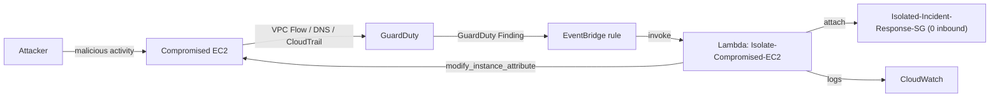

# Automated Cloud Incident Response (VPC Extension)

An event-driven security automation pipeline that detects malicious activity and automatically quarantines the compromised EC2 instance. **AWS GuardDuty** detects the threat, **Amazon EventBridge** routes the finding, and an **AWS Lambda** function strips the instance's security groups and attaches an isolation security group, cutting off the attacker while keeping the machine alive for forensics.

This project extends the [AWS VPC Lab](https://github.com/TamiDeji04/VPC-LAB): it builds the automated response layer on top of the custom `tami-cloud` VPC and the SSM-managed EC2 instance created there.

---

## Architecture

---

## How it connects to the VPC lab

| VPC lab provides | This project adds |
|---|---|
| Custom VPC `tami-cloud` (`10.0.0.0/16`, `us-east-2`) | `Isolated-Incident-Response-SG` inside that VPC |
| `tami-ec2-server` (SSM-managed, no open ports) | The disposable target that gets quarantined |
| Hand-built, secure networking | Automated, event-driven incident response |

The VPC lab proves you can build a secure network by hand. This project proves you can automate the response when something inside that network goes wrong.

---

## Documentation

Full walkthrough, with the architectural reasoning behind every step and console screenshots, lives in [`docs/incident-response/`](docs/incident-response/README.md).

| Phase | What it builds |
|---|---|
| [Phase 1: Isolation Security Group](docs/incident-response/phase-1-isolation-sg.md) | The quarantine SG with no inbound access |
| [Phase 2: Enable GuardDuty](docs/incident-response/phase-2-enable-guardduty.md) | Continuous threat detection |
| [Phase 3: Lambda IAM Execution Role](docs/incident-response/phase-3-iam-execution-role.md) | Least-privilege permissions for the responder |
| [Phase 4: Python Lambda Function](docs/incident-response/phase-4-lambda-function.md) | The code that performs the isolation |
| [Phase 5: EventBridge Rule](docs/incident-response/phase-5-eventbridge-rule.md) | The glue that routes findings to Lambda |
| [Phase 6: Testing and Validation](docs/incident-response/phase-6-testing-validation.md) | Safe, end-to-end verification |

The Lambda source is at [`docs/incident-response/lambda/lambda_function.py`](docs/incident-response/lambda/lambda_function.py).

---

## Key resources

| Resource | Name / value |
|---|---|
| Isolation security group | `Isolated-Incident-Response-SG` |
| VPC | `tami-cloud` |
| Lambda function | `Isolate-Compromised-EC2` (Python 3.12) |
| Lambda execution role | `Lambda-EC2-Quarantine-Role` |
| EventBridge rule | `Trigger-GuardDuty-Incident-Response` |
| Region | `us-east-2` (Ohio) |

---

## Core ideas

- **Containment over termination:** quarantine preserves volatile memory for forensics instead of destroying evidence.
- **Push, not poll:** EventBridge invokes the responder the instant a finding appears, minimizing the attacker's window.
- **Least privilege:** the Lambda can isolate an instance but cannot delete or terminate anything else.
- **Safe validation:** tested with GuardDuty sample findings, never real malware.
