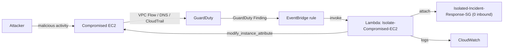

# Automated Cloud Incident Response

An event-driven automation pipeline that detects malicious activity and quarantines the affected EC2 instance without human intervention. **AWS GuardDuty** detects the threat, **Amazon EventBridge** intercepts the finding, and an **AWS Lambda** function strips the compromised instance's security groups and attaches an isolation security group, severing the attacker's access while keeping the machine running for forensics.

This module extends the [VPC lab](https://github.com/TamiDeji04/VPC-LAB): the isolation security group lives inside that same custom VPC (`tami-cloud`), and the disposable target instance is the lab's SSM-managed `tami-ec2-server`. **Region:** `us-east-2` (Ohio), consistent with the parent lab.

---

## Architecture



The flow is entirely push-based: GuardDuty publishes findings to EventBridge automatically, EventBridge invokes the Lambda the instant a finding matches, and the Lambda performs the quarantine in a single API call.

---

## How it connects to the VPC lab

| VPC lab provides | This module adds |
|---|---|
| Custom VPC `tami-cloud` (`10.0.0.0/16`) | `Isolated-Incident-Response-SG` inside that VPC |
| `tami-ec2-server` (SSM-managed, no open ports) | The disposable target that gets quarantined |
| `tami-security` SG (zero inbound) | Lambda that *replaces* an instance's SGs on a finding |
| Manual, hand-built networking | Automated, event-driven security response |

The VPC lab proves you can build a secure network by hand. This module proves you can automate the response when something inside that network goes wrong.

---

## Phases

| Phase | What it builds |
|---|---|
| [Phase 1: Isolation Security Group](phase-1-isolation-sg.md) | The quarantine SG with no inbound access |
| [Phase 2: Enable GuardDuty](phase-2-enable-guardduty.md) | Continuous threat detection |
| [Phase 3: Lambda IAM Execution Role](phase-3-iam-execution-role.md) | Least-privilege permissions for the responder |
| [Phase 4: Python Lambda Function](phase-4-lambda-function.md) | The code that performs the isolation |
| [Phase 5: EventBridge Rule](phase-5-eventbridge-rule.md) | The glue that routes findings to Lambda |
| [Phase 6: Testing and Validation](phase-6-testing-validation.md) | Safe, end-to-end verification |

---

## Repository layout

```
docs/incident-response/
├── README.md                     # this file
├── phase-1-isolation-sg.md
├── phase-2-enable-guardduty.md
├── phase-3-iam-execution-role.md
├── phase-4-lambda-function.md
├── phase-5-eventbridge-rule.md
├── phase-6-testing-validation.md
├── lambda/
│   └── lambda_function.py        # the deployed responder (SG ID as placeholder)
└── screenshots/
    ├── README.md                 # screenshot catalog
    └── *.png                     # console screenshots, one set per phase
```

---

## Key resources

| Resource | Name / value |
|---|---|
| Isolation security group | `Isolated-Incident-Response-SG` (`sg-013b730ecffce4ef5`) |
| VPC | `tami-cloud` (`vpc-0a5145ae54e6fc9ac`) |
| Lambda function | `Isolate-Compromised-EC2` (Python 3.12) |
| Lambda execution role | `Lambda-EC2-Quarantine-Role` |
| Lambda policy | `Lambda-EC2-Quarantine-Policy` |
| EventBridge rule | `Trigger-GuardDuty-Incident-Response` |
| Region | `us-east-2` (Ohio) |

---

## What this proves to an employer

1. Event-driven architecture: connecting detection to response with no polling.
2. Least-privilege IAM: a responder that can isolate but cannot destroy.
3. Incident response fundamentals: containment over termination, preserving forensic state.
4. Serverless automation with Boto3 against the EC2 API.
5. Safe validation of security tooling using sample findings rather than real attacks.
6. Building automation on top of a network you designed yourself.
