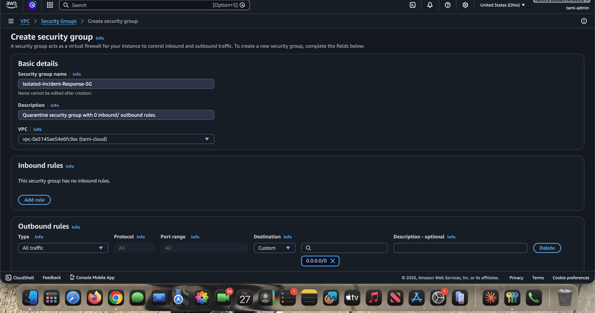
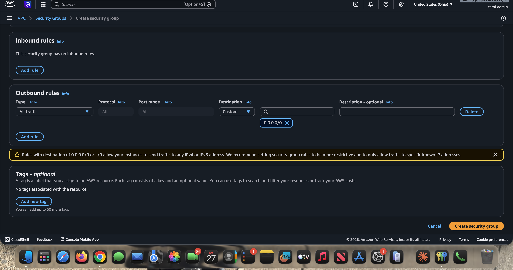
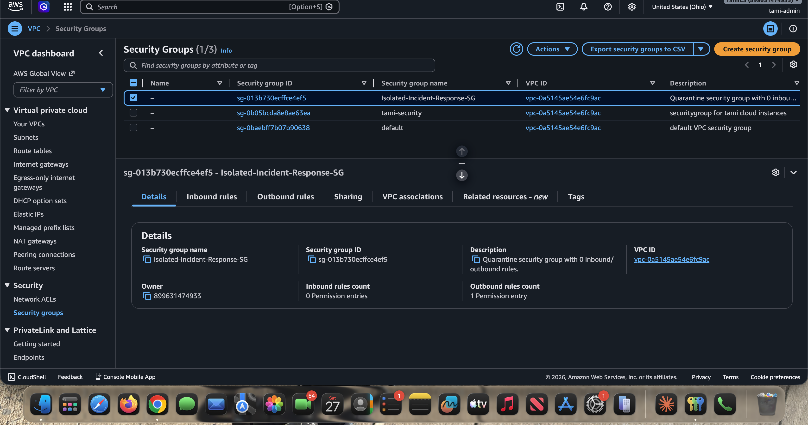
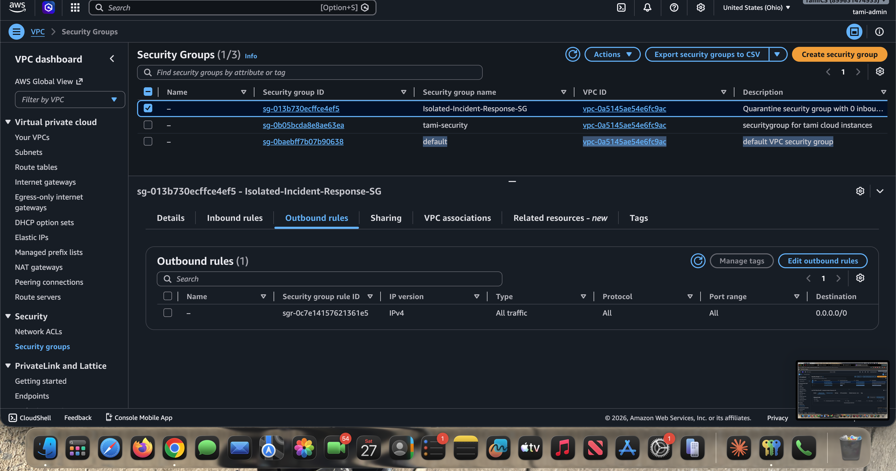
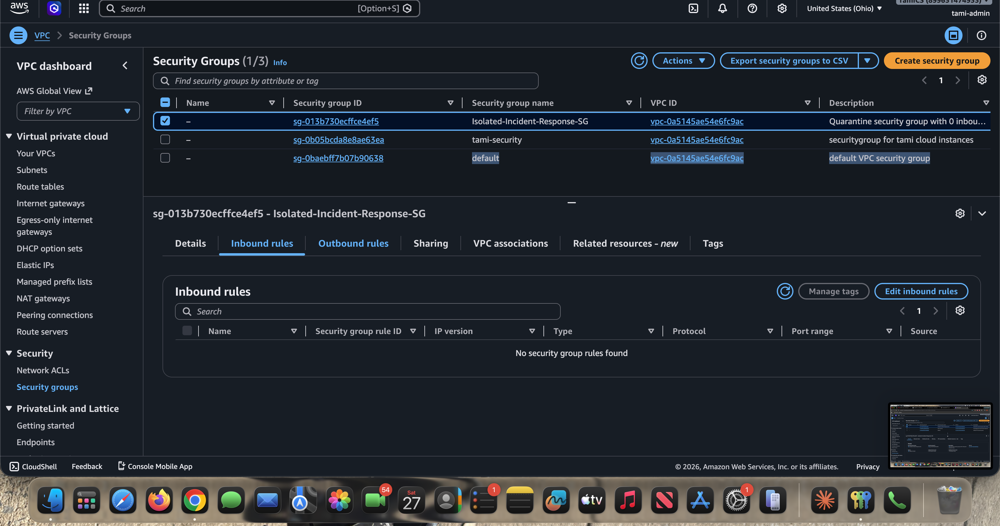

# Phase 1: Create the Isolation Security Group

The isolation security group is the quarantine cell. When the automation fires, it strips a compromised instance of every existing security group and replaces them with this one, severing the attacker's access while keeping the machine alive for forensics.

This security group is created inside the same custom VPC (`tami-cloud`, `vpc-0a5145ae54e6fc9ac`) built in the [VPC lab](https://github.com/TamiDeji04/VPC-LAB).

---

## The How

1. Navigate to the **VPC Console** > **Security Groups**.
2. Click **Create security group**.
   - **Name:** `Isolated-Incident-Response-SG`
   - **Description:** Quarantine security group with 0 inbound/ outbound rules.
   - **VPC:** Select the custom VPC from your `VPC-LAB` (`tami-cloud`).
3. **Inbound rules:** Leave completely empty.
4. **Outbound rules:** For a true quarantine, remove the default "Allow All" rule so it is also empty.
5. Click **Create security group** and note the **Security Group ID** (here: `sg-013b730ecffce4ef5`).

The create form, with the name, description, and target VPC set:

Inbound rules left empty and the outbound rule shown before removal:

Confirming zero inbound rules after creation:

The outbound rules tab:

The final Security Group details view:

---

## The Why

- **Containment over termination.** When an instance is compromised, the instinct is to shut it down. But terminating or stopping a server destroys volatile memory (RAM). Incident response and forensics teams need that memory to reconstruct *how* the attacker got in. Quarantine keeps the box running and intact.
- **Zero trust.** A security group with no inbound or outbound rules instantly severs the attacker's connection and stops malware from spreading laterally to other subnets in the VPC, all while keeping the machine alive for forensic capture.
- **Reuse of the lab VPC.** Placing the isolation SG inside the existing `tami-cloud` VPC means any instance from the lab (such as `tami-ec2-server`) can be quarantined without cross-VPC plumbing.

---

## As-built note: outbound rule

In the build captured here, the security group was left with its **default outbound rule** (All traffic to `0.0.0.0/0`) still attached, and only the inbound side empty. That is enough to block all *incoming* attacker connections.

For a stricter, textbook zero-trust quarantine, also delete the outbound rule so the instance cannot exfiltrate data or call out to a command-and-control server. The trade-off: a fully sealed instance cannot reach the SSM endpoints, so an analyst would attach forensic tooling another way (for example, via VPC endpoints or by snapshotting the EBS volume). Choose based on whether live remote forensics or hard containment matters more for your scenario.

---

Next: [Phase 2 - Enable AWS GuardDuty](phase-2-enable-guardduty.md)
