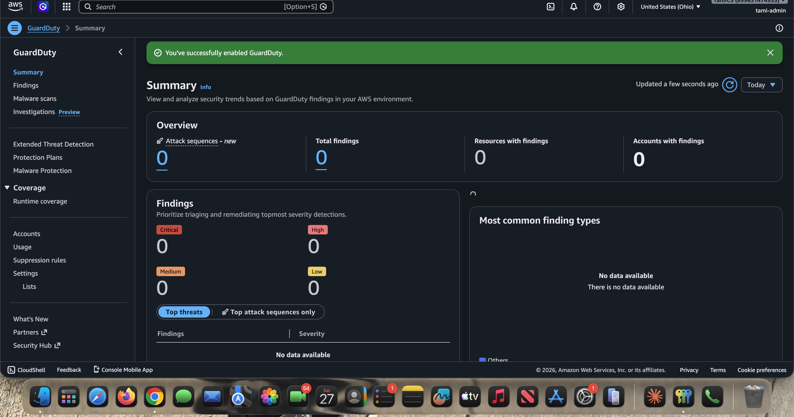

# Phase 2: Enable AWS GuardDuty

GuardDuty is the detector. It continuously analyzes activity across your AWS account and raises a finding when it sees something malicious. That finding is the trigger for the entire automation.

---

## The How

1. Navigate to the **GuardDuty Console**.
2. Click **Get Started**, then **Enable GuardDuty**.

A freshly enabled detector with zero findings:

---

## The Why

- **Continuous monitoring.** GuardDuty uses machine learning and integrated threat intelligence to analyze tens of billions of events across multiple AWS data sources: VPC Flow Logs, CloudTrail management events, and DNS query logs. No agents to install, no log pipelines to build.
- **Operational efficiency.** You *could* write custom scripts to parse VPC Flow Logs looking for malicious IPs, but that is complex, expensive, and error-prone. GuardDuty abstracts the heavy lifting of detection so you can focus on the response.
- **Native EventBridge integration.** Every GuardDuty finding is automatically published to EventBridge, which is exactly the hook used in [Phase 5](phase-5-eventbridge-rule.md) to invoke the Lambda. No extra wiring is needed on the detection side.

---

Next: [Phase 3 - Create the Lambda IAM Execution Role](phase-3-iam-execution-role.md)
