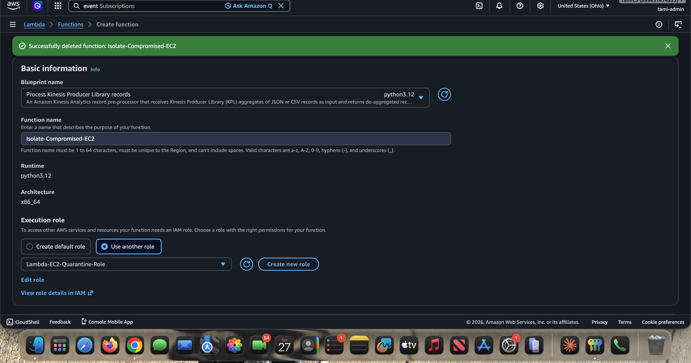

# Phase 3: Create the Lambda IAM Execution Role

The Lambda function needs permission to inspect and modify EC2 instances and to write its own logs. AWS services do not trust each other by default, so this role is what allows the function to act at all, and the policy is what keeps that power tightly scoped.

In this build the role is named **`Lambda-EC2-Quarantine-Role`** (the screenshots reflect this name).

---

## The How

1. Go to the **IAM Console** > **Roles** > **Create role** > **AWS service** > **Lambda**.
2. Click **Create policy**, select the **JSON** tab, and paste:

```json
{
    "Version": "2012-10-17",
    "Statement": [
        {
            "Effect": "Allow",
            "Action": [
                "logs:CreateLogGroup",
                "logs:CreateLogStream",
                "logs:PutLogEvents"
            ],
            "Resource": "arn:aws:logs:*:*:*"
        },
        {
            "Effect": "Allow",
            "Action": [
                "ec2:DescribeInstances",
                "ec2:ModifyInstanceAttribute"
            ],
            "Resource": "*"
        }
    ]
}
```

3. Name the policy `Lambda-EC2-Quarantine-Policy`.
4. Attach the policy to the role, name the role `Lambda-EC2-Quarantine-Role`, and create it.

The role is selected when the Lambda function is created (see Phase 4). This screenshot shows the create-function screen using the existing `Lambda-EC2-Quarantine-Role`:



---

## The Why

- **The principle of least privilege.** A Lambda function cannot touch your EC2 instances unless explicitly permitted. This policy grants exactly two EC2 actions (`DescribeInstances`, `ModifyInstanceAttribute`) plus the three logging actions, and nothing else.
- **Limiting blast radius.** If an attacker somehow compromised this Lambda, they could not use it to delete databases, terminate infrastructure, or read S3, because the policy denies (by omission) every action that is not listed.
- **Observability requires log permissions.** The three `logs:*` actions are what let the function create its CloudWatch log group and stream. Without them, the `print()` statements in [Phase 4](phase-4-lambda-function.md) would have nowhere to go and debugging in [Phase 6](phase-6-testing-validation.md) would be impossible.

---

## Naming note

The reference walkthrough this project was built from suggested the role name `Lambda-Incident-Response-Execution-Role` and the same policy name `Lambda-EC2-Quarantine-Policy`. This build uses `Lambda-EC2-Quarantine-Role` for the role. The permissions are identical; only the label differs. Use whichever convention you prefer, but keep it consistent with what you select in Phase 4.

---

Next: [Phase 4 - Write the Python Lambda Function](phase-4-lambda-function.md)
