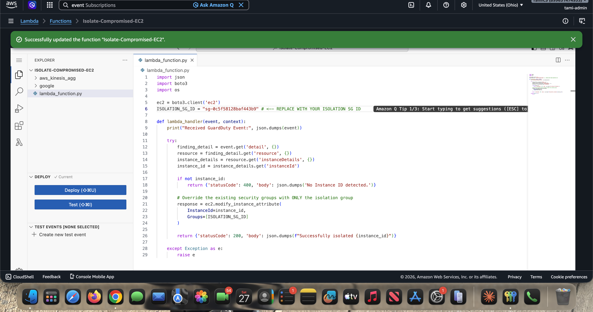
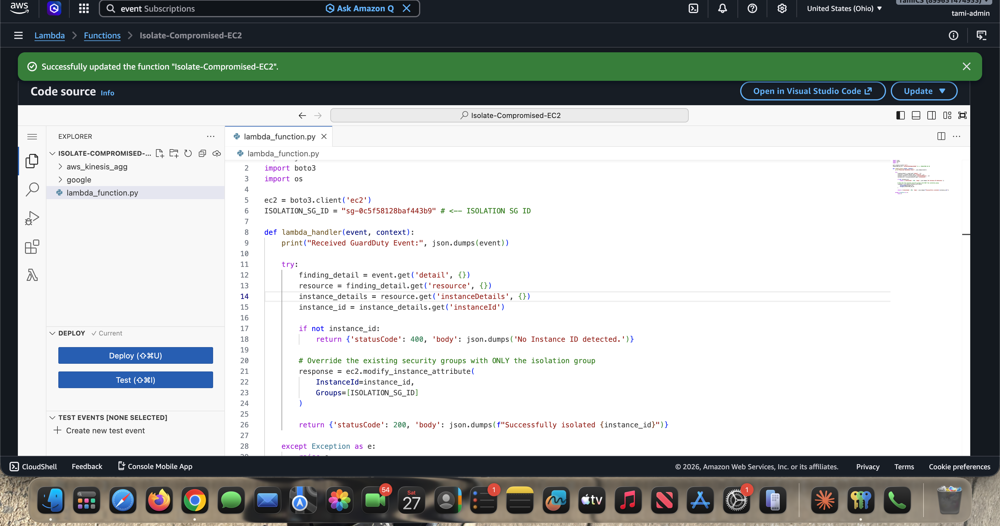

# Phase 4: Write the Python Lambda Function

This is the responder. When EventBridge delivers a GuardDuty finding, this function parses out the affected instance ID and overwrites that instance's security groups with only the isolation group from [Phase 1](phase-1-isolation-sg.md).

The full source lives at [`lambda/lambda_function.py`](lambda/lambda_function.py).

---

## The How

1. Go to the **Lambda Console** > **Create function**.
2. Configure:
   - **Name:** `Isolate-Compromised-EC2`
   - **Runtime:** `Python 3.12`
   - **Execution role:** `Lambda-EC2-Quarantine-Role` (from [Phase 3](phase-3-iam-execution-role.md))
3. In the **Code** tab, deploy the script below (replace the Security Group ID with your own), then click **Deploy**.

```python
import json
import boto3
import os

ec2 = boto3.client('ec2')

# Replace with your own Isolation Security Group ID, or set the
# ISOLATION_SG_ID environment variable on the Lambda function.
ISOLATION_SG_ID = os.environ.get('ISOLATION_SG_ID', 'sg-xxxxxxxxxxxxxxxxx')


def lambda_handler(event, context):
    print("Received GuardDuty Event:", json.dumps(event))

    try:
        finding_detail = event.get('detail', {})
        resource = finding_detail.get('resource', {})
        instance_details = resource.get('instanceDetails', {})
        instance_id = instance_details.get('instanceId')

        if not instance_id:
            return {'statusCode': 400, 'body': json.dumps('No Instance ID detected.')}

        # Override the existing security groups with ONLY the isolation group.
        response = ec2.modify_instance_attribute(
            InstanceId=instance_id,
            Groups=[ISOLATION_SG_ID]
        )

        return {'statusCode': 200, 'body': json.dumps(f"Successfully isolated {instance_id}")}

    except Exception as e:
        raise e
```

The deployed function code in the Lambda console:



The code source view after a successful deploy:



---

## The Why

- **Serverless compute.** Lambda is used because it is serverless. You do not want to pay for a dedicated server running 24/7 waiting for an attack that might happen once a year. Lambda charges by the millisecond, only when it runs.
- **Boto3 (the AWS SDK).** Boto3 is the Python library that wraps the AWS API. It lets the code authenticate (using the execution role's temporary credentials) and run the exact same `modify-instance-attribute` operation you would otherwise click in the console.
- **Overwrite, not append.** `modify_instance_attribute` with `Groups=[ISOLATION_SG_ID]` *replaces* the full set of security groups. This is deliberate: it removes whatever access the attacker was using in a single atomic call, rather than layering a deny on top of existing allows.
- **Defensive parsing.** The handler uses `.get()` with defaults at each level so a malformed or unexpected event returns a clean `400` instead of crashing, and only attempts isolation once a real `instanceId` is found.

---

## As-built note: created from a blueprint

In this build the function was originally created from a **Kinesis "Process Kinesis Producer Library records" blueprint** (and recreated once) before the code above was pasted in and deployed. The blueprint is irrelevant to the final result; the cleaner path is to create the function as **Author from scratch** with the Python 3.12 runtime and the `Lambda-EC2-Quarantine-Role`, then paste the script. The end state is identical.

> Tip: instead of hardcoding the SG ID in the source, set an `ISOLATION_SG_ID` environment variable on the function. The provided code already reads it and falls back to the placeholder if it is unset.

---

Next: [Phase 5 - Connect GuardDuty to Lambda via EventBridge](phase-5-eventbridge-rule.md)
