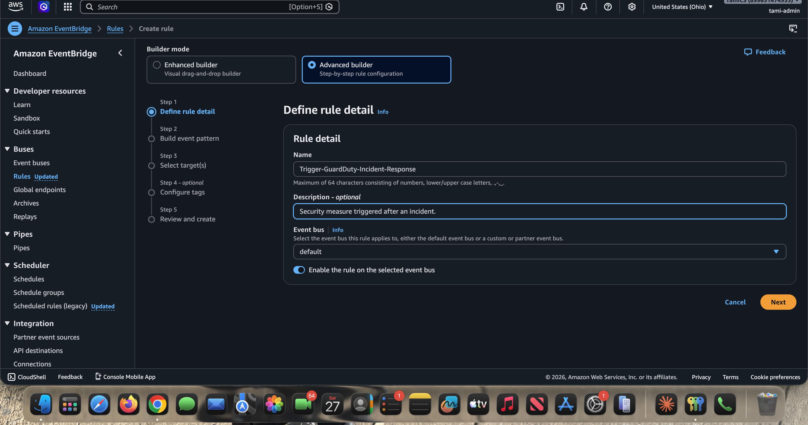
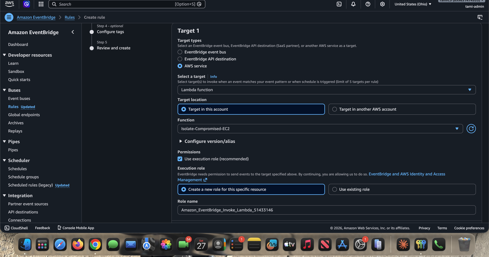
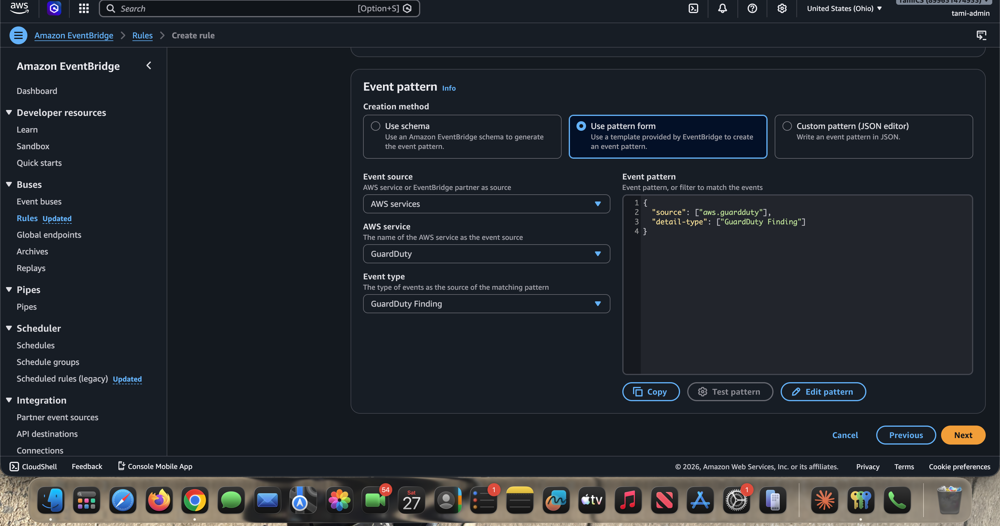

# Phase 5: Connect GuardDuty to Lambda via EventBridge

EventBridge is the glue. It listens for GuardDuty findings and routes them to the Lambda the instant they appear. This is what turns a detector and a responder into an automated pipeline.

---

## The How

1. Navigate to the **Amazon EventBridge Console** > **Rules** > **Create rule**.
2. Define the rule:
   - **Name:** `Trigger-GuardDuty-Incident-Response`
   - **Description:** Security measure triggered after an incident.
   - **Event bus:** `default`
   - **Rule type:** Rule with an event pattern.



3. Build the event pattern:
   - **Event source:** AWS services
   - **AWS service:** GuardDuty
   - **Event type:** GuardDuty Finding

   This produces the pattern:

```json
{
  "source": ["aws.guardduty"],
  "detail-type": ["GuardDuty Finding"]
}
```



4. Select the target:
   - **Target type:** AWS service
   - **Target:** Lambda function
   - **Function:** `Isolate-Compromised-EC2`
   - Let EventBridge **create a new role for this specific resource** to grant itself permission to invoke the function.



---

## The Why

- **Event-driven architecture.** You need something to connect the detector (GuardDuty) to the responder (Lambda). EventBridge is the central router that matches events to targets.
- **Push vs. pull.** Without EventBridge, the Lambda would have to run on a schedule and constantly poll GuardDuty for new alerts, which is slow and wastes money. EventBridge lets GuardDuty *push* the finding to Lambda the exact second an anomaly is detected, shrinking the attacker's window of opportunity to near zero.
- **Pattern filtering.** The event pattern ensures the Lambda is invoked only for `aws.guardduty` `GuardDuty Finding` events, not for unrelated traffic on the default bus.

---

## As-built note: invoke permission

When EventBridge creates the rule with a Lambda target, it auto-provisions an invoke role (named like `Amazon_EventBridge_Invoke_Lambda_...`) and adds the resource-based permission that lets the rule call the function. This step is implicit in the console wizard, but it is what actually authorizes the trigger. If you ever wire the target up manually or via IaC, remember to add the `lambda:InvokeFunction` permission for the EventBridge principal yourself.

---

Next: [Phase 6 - Testing and Validation](phase-6-testing-validation.md)
