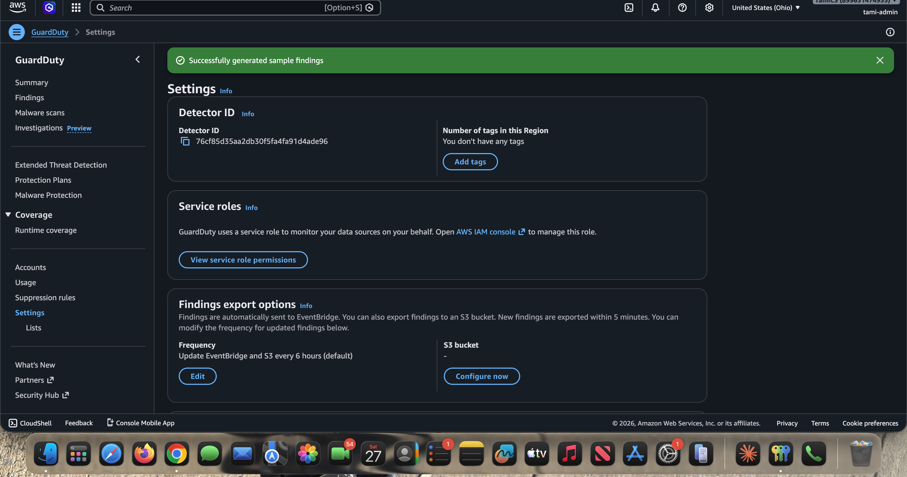
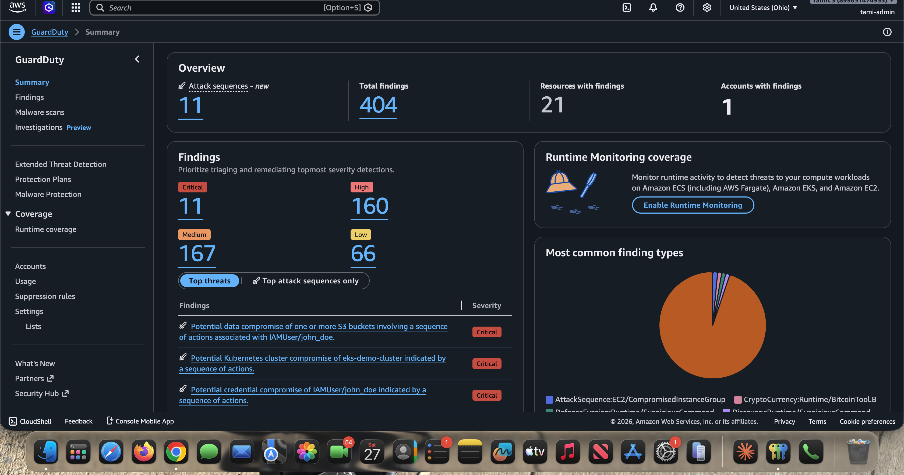
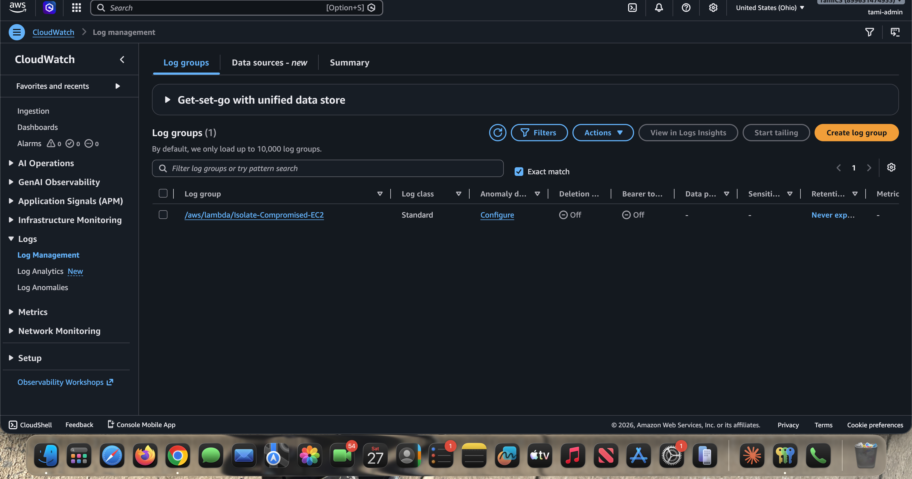
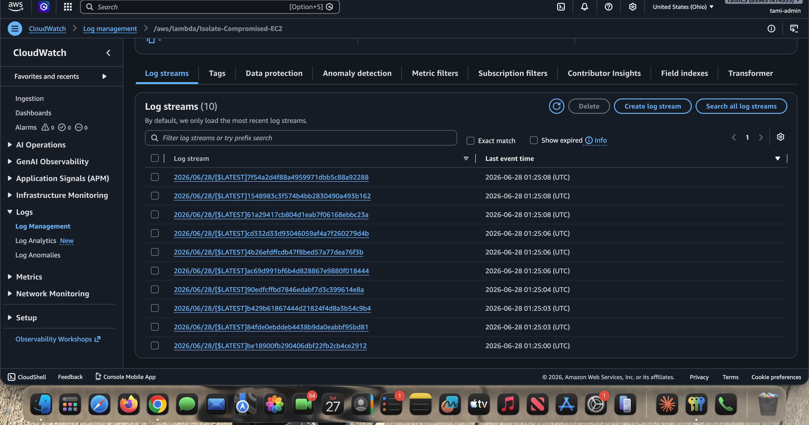
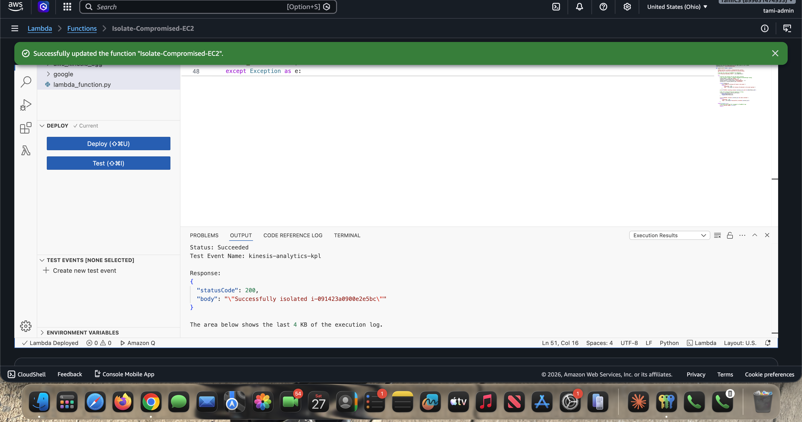
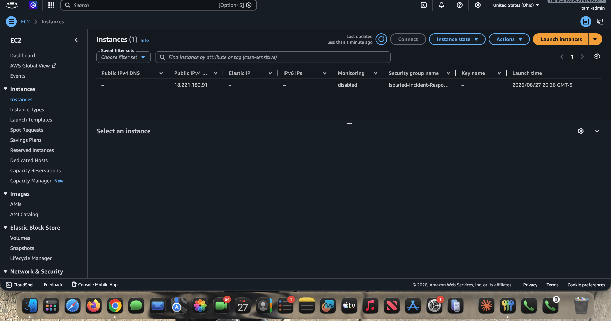

# Phase 6: Testing and Validation

You never test security automation by infecting your own infrastructure, and you never wait for a real attack to find out whether your code works. GuardDuty can generate sample findings that flow through the exact same pipeline, letting you validate end to end safely.

---

## The How

1. In the **GuardDuty Console** > **Settings**, click **Generate sample findings**.

2. The sample findings populate the GuardDuty summary (here, hundreds of findings across severities). Each finding type such as `UnauthorizedAccess:EC2/TorIPCaller` carries an instance ID in its payload.

3. Confirm the Lambda executed by checking **CloudWatch** > **Log groups** for `/aws/lambda/Isolate-Compromised-EC2`.

4. Open the log group to see one log stream per invocation.

5. Run a direct Lambda test. The execution result returns `statusCode 200` with a body confirming the instance was isolated:

6. Verify in the **EC2 Console** that the instance's security group was changed to `Isolated-Incident-Response-SG`.

---

## The Why

- **Safe simulation.** Sample findings inject realistic dummy payloads into EventBridge so you can confirm the Lambda parses the data correctly and performs the isolation, without any real malware or real attacker.
- **Observability (CloudWatch).** The `print()` statements in the function stream automatically to CloudWatch Logs. If the automation fails, these logs are the fastest way to debug *why*, whether it is an IAM permissions error, a typo in the Security Group ID, or an unexpected event shape.
- **End-to-end proof.** Seeing `statusCode 200` and the EC2 instance now carrying only the isolation SG confirms every link in the chain works: GuardDuty raised the finding, EventBridge routed it, the IAM role authorized the call, and the Lambda performed the quarantine.

---

## A note on sample findings vs. live triggers

Generating sample findings is the reliable way to validate the Lambda's parsing and isolation logic, and a direct Lambda **Test** event (as shown above) confirms the function end to end. Note that some GuardDuty *sample* findings reference placeholder instance IDs rather than a real running instance, so the cleanest full-loop test is to keep a disposable EC2 instance (such as `tami-ec2-server` from the VPC lab) available and confirm its security group flips to the isolation SG.

---

Back to the [module overview](README.md).
